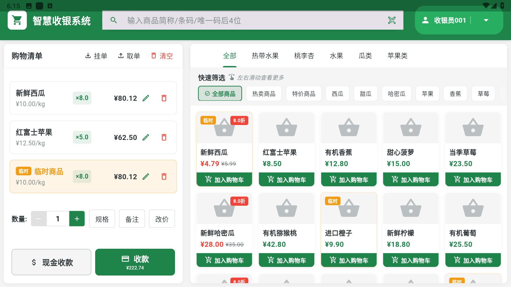

# Flutter POS系统

一个基于Flutter构建的收银系统客户端界面原型，采用现代化的技术栈和清晰的项目结构设计。

## 项目截图

### 登录界面


### 收银界面



## 技术栈

本项目采用了以下现代Flutter技术栈：

- **Flutter版本**: 3.10.0+
- **Dart版本**: 3.0.0+

### 状态管理
- **Flutter Riverpod** (2.4.9): 声明式状态管理解决方案
- **Riverpod Annotation & Generator**: 用于生成Provider代码，减少模板代码

### 路由管理
- **Go Router** (12.1.3): Flutter官方推荐的声明式路由方案

### 本地存储
- **Hive** (2.2.3): 轻量级的NoSQL数据库，用于本地数据持久化
- **Hive Flutter**: Hive的Flutter适配
- **SharedPreferences**: 简单键值对存储

### UI组件和适配
- **Flutter ScreenUtil**: 屏幕适配方案，支持不同尺寸设备
- **Cached Network Image**: 网络图片缓存处理
- **Flutter SVG**: SVG图像支持

### 国际化
- **Slang**: 简洁的国际化解决方案，比官方arb更简便

### 工具与辅助
- **Logger**: 生产环境安全的日志工具
- **Get It**: 依赖注入服务定位器
- **Equatable**: 简化对象比较

### 开发工具
- **Build Runner**: 代码生成工具
- **Freezed**: 不可变数据类生成
- **Very Good Analysis**: 严格的Flutter代码规范

## 项目结构

```
lib/
├── app/                    # 应用核心配置
│   ├── localization/       # 国际化配置
│   ├── router/             # 路由配置
│   ├── theme/              # 主题配置
│   └── app.dart            # 应用根组件
├── core/                   # 核心服务和工具
│   ├── services/           # 核心服务实现
│   └── utils/              # 工具类和扩展方法
├── features/               # 功能模块（按领域划分）
│   ├── auth/               # 认证模块
│   │   └── presentation/   # UI层
│   │       └── pages/      # 页面组件
│   └── pos/                # 收银模块
│       └── presentation/   # UI层
│           └── pages/      # 页面组件
└── main.dart               # 应用入口
```

## 项目说明

### 当前状态
本项目目前是一个**静态客户端界面原型**，主要实现了：

- **登录界面**: 包含基本的登录表单和记住密码功能
- **收银界面**: 静态的商品展示和购物车界面

请注意，该项目当前仅实现了UI界面，大部分功能（如实际的商品管理、支付处理等）尚未实现。

### 主要特点

- **横屏模式**: 应用针对POS机和平板设备进行了横屏优化
- **Material Design**: 使用现代化的Material设计语言
- **响应式布局**: 适配不同尺寸的屏幕

## 运行环境

- Flutter: 3.10.0 或更高版本
- Dart: 3.0.0 或更高版本
- 支持平台: Android、iOS、Windows、macOS、Linux、Web

## 安装和运行

1. 确保已安装Flutter SDK
```bash
flutter --version
```

2. 克隆项目
```bash
git clone <项目仓库URL>
```

3. 安装依赖
```bash
flutter pub get
```

4. 运行应用
```bash
flutter run
```

## 未来计划

- 实现后端API集成
- 完善商品管理功能
- 添加实际支付处理逻辑
- 增加数据统计和分析功能
